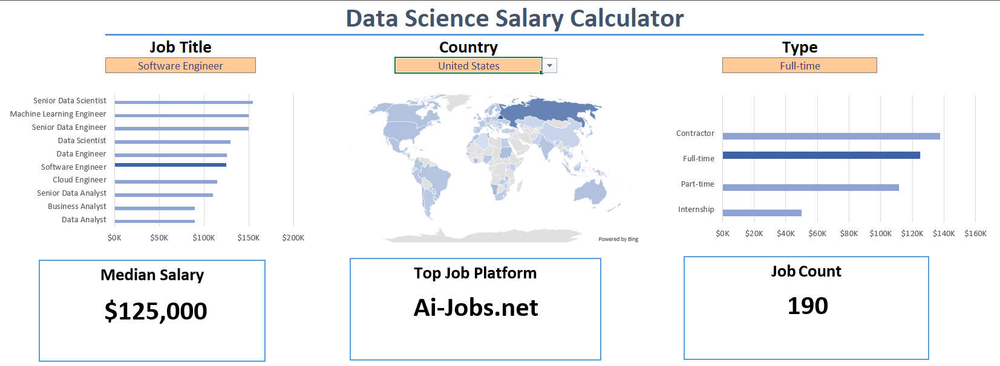
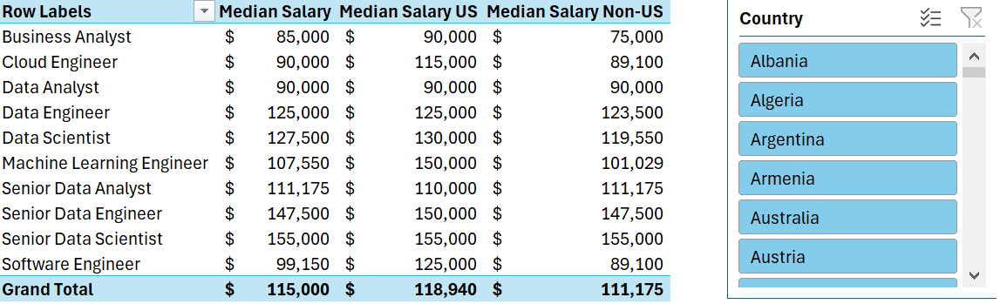
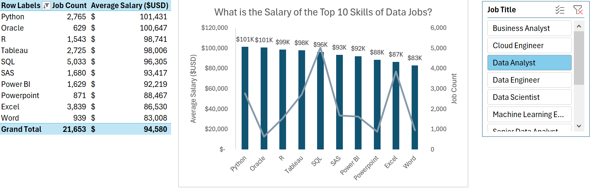
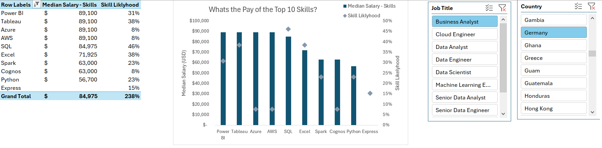

# Excel Data Science Salary Analysis


### Interactive Excel Dashboard & Salary Analysis of the Global Data Science Job Market

> A professional Excel analytics project combining interactive dashboards, PivotTables, PivotCharts, slicers, and salary analysis to explore compensation, job demand, and required skills across the global data science industry.

---

# Project Summary

This project analyzes thousands of global data science job postings to identify salary trends, the highest-paying job titles, the most valuable technical skills, and regional compensation differences.

The analysis was completed entirely in Microsoft Excel using PivotTables, PivotCharts, slicers, geographic maps, and interactive dashboards to transform raw job posting data into business insights.

The repository contains two complementary Excel workbooks:

- **Interactive Dashboard** — an executive dashboard allowing users to filter salaries by country, job title, and employment type.
- **Salary & Skills Analysis** — a deeper analytical workbook exploring salary distributions, skill premiums, and market demand.

---

# Dashboard Preview



---

# Salary Analysis Workbook

## Salary Comparison



---

## Highest Paying Skills



---

## Skill Salary Analysis



---

# Repository Structure

```
Excel-Data-Science-Salary-Analysis
│
├── Dashboard-Data-Science-Salaries.xlsx
├── Skills-and-Salary-Analysis.xlsx
├── Images
│   ├── dashboard.png
│   ├── salary_analysis.png
│   ├── top_skills.png
│   └── skill_salary.png
└── README.md
```

---

# Project Objectives

- Analyze global salaries for data-related careers
- Compare compensation across countries
- Identify the highest-paying technical skills
- Explore relationships between salary and skill demand
- Build an interactive Excel dashboard for business users
- Practice data visualization and reporting in Excel

---

# Excel Features Used

- Pivot Tables
- Pivot Charts
- Interactive Slicers
- Geographic Map Charts
- Dynamic Filtering
- Conditional Formatting
- Lookup Functions
- Dashboard Design
- Data Cleaning
- Calculated Fields

---

# Key Insights

| Insight | Finding |
|----------|----------|
| Highest Paying Roles | Senior Data Scientist and Senior Data Engineer consistently command the highest salaries. |
| Geography | Salaries vary significantly across countries, with the United States leading most categories. |
| Valuable Skills | Spark, Java, SQL, TensorFlow, AWS, and Python offer the strongest salary premiums. |
| Demand | Python and SQL remain among the most requested skills across job postings. |
| Dashboard | Interactive filtering enables rapid comparison across countries, job titles, and employment types. |

---

# Skills Demonstrated

- Microsoft Excel
- Business Intelligence
- Dashboard Development
- Data Visualization
- Data Cleaning
- Salary Analytics
- PivotTables
- PivotCharts
- Interactive Reporting

---

# Data Source

Global Data Science Salary & Job Posting Dataset

---

# Future Improvements

- Power Query automation
- Power Pivot data model
- KPI dashboard
- Time-series salary analysis
- Power BI version
- Python integration for automated updates